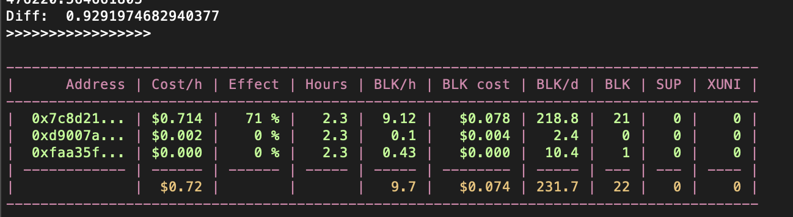

Backlog
---------------
In the Miner Group view, XenBlocks wallet history: change resolution from hours to minutes in the history table
        A shorter resoltion will be more accurate as the cost per hour changes frequently and 
        the calculation errors will be large if too old history values are used

In the Instance Table view: reset XUNI count also when block count is reset, but skip super.

In the Miner Group view: include historic values for cost per hour in the cost calculation

Auto Miner:
- set a max balance in USD/hour and the Auto Miner tries to mine up to that balance, i.e. purge bad miners, buy new  when budget allows
- configure a minimum DFLOPS

Develop
---------------
-

Verification
---------------
DB refactoring
Auto reset
Auto Miner

Done
---------------

Bugs backlog
----------------
Total cost is lower than sum of each row

