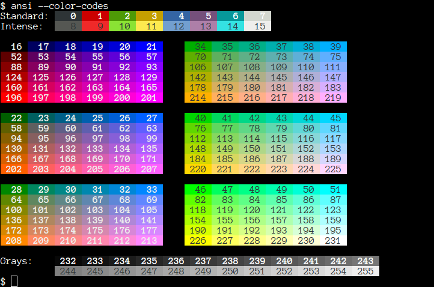

https://github.com/TreeCityWes/XenBlocks-Assistant.git




# Vast.ai XenBlocks Mining Assistant

Welcome to TreeCityWes.eth's Vast.ai XenBlocks Mining Assistant! This Python tool optimizes XenBlocks X1 mining on Vast.ai, helping you monitor instance stats, terminate non-profitable instances, and discover new lucrative offers.

## Features

- **Monitor Instance Stats:** Automatically fetch and display key metrics from your mining instances.
- **Kill Dead Instances:** Identify and terminate unprofitable instances, cutting unnecessary expenses.
- **Find New Offers:** Use advanced filtering to uncover the most cost-effective mining opportunities on Vast.ai.

## Getting Started

### Prerequisites

- Python 3.6 or later.
- A Vast.ai API key and wallet address configured via an .env file for secure access.

### Setup

1. **Clone the repository:**
   ```bash
   git clone https://github.com/TreeCityWes/XenBlocks-Assistant.git
   cd XenBlocks-Assistant
   ```

2. **Install dependencies:**
   ```bash
   pip install -r requirements.txt
   pip install --upgrade vastai
   vastai set apikey (your API key)
   ```

   

3. **Configure .ENV File:**

   Create a `.env` file in the root directory of the project with your Vast.ai API key and wallet address.

   This file should contain the following lines:
   ```
   API_KEY=your_vast_ai_api_key
   ADDR=your_wallet_address
   ```

   Replace `your_vast_ai_api_key` and `your_wallet_address` with the actual values you wish to use for mining.

### Usage

Run the script from the command line:
```bash
python3 vastmon.py
```

# Running Image On Local Machine (Baremetal)

Follow the on-screen instructions to monitor your instances, terminate non-profitable ones, or find new offers.

First, install required libraries. See first two steps at https://docs.nvidia.com/datacenter/cloud-native/container-toolkit/latest/install-guide.html

Install Docker:
```bash
sudo apt install docker.io
```

After installation, add your user to the Docker group:
```bash
sudo usermod -aG docker your_username
```

Reboot the machine (safest way):
```bash
sudo reboot
```

Execute the Docker command with your Xenblocks address. Make sure to replace 'your_username' with your actual username and 'your_xenblocks_address' with your actual Xenblocks address:
```bash
docker run -it -d --restart unless-stopped -p 2222:22 -p 8080:8080 -p 8000:8000 --active_gpus=all -e ADDR=your_xenblocks_address smit1237/xengpuminer:vast
```

This command downloads an image (3.7 gigabytes in size) with all you need to mine. After it's done, it will start mining. You can observe a nice and simple web UI on http://your_mining_machine_ip:8080. You can safely reboot the machine; mining will start automatically unless you stop it.


### Support

For support, visit [HashHead.io](https://hashhead.io)

Or Buy Us A Coffee! 
- Smit: [buymeacoffee.com/smit1237](https://buymeacoffee.com/smit1237)
- Wes: [buymeacoffee.com/treecitywes](https://buymeacoffee.com/treecitywes)

This project is designed to work with Smit1237's XenBlocks Template on Vast.ai. 
For more details, refer to the template and Docker links provided.


leaderboard table data file:

        <tr>
          <td>2</td>
          <td>0x7d39f1372f95fbb67d259ac26443b69eb944f1d0</td>
          <td>385384</td>
          <td>504</td> <!-- New cell -->
          <td>100000.0</td> <!-- Moved to last position -->
        </tr>

Saved to DB: MinerStatistics(id=0x7c8d21f88291b70c1a05ae1f0bc6b53e52c4f28a, 
rank=867, override=False, timestamp_s=1714164141, duration_hours=13.2, 
cost_per_hour=0.047894715238161675, difficulty=0, hashrate=0.0, block=18, super=0, xuni=0)


https://stackoverflow.com/questions/16196268/where-should-i-put-my-own-python-module-so-that-it-can-be-imported

```bash
mkdir -p "`python -m site --user-site`"
```


-----------------------------------------------------------------------------------------------------------------------------------------------------------------------
|  # |  Vast ID |     GPU | Cost/h | DFlop | MS | Ov |  Hash | Hash/$ | Hours | BLK/h |  BLK $ | BLK/d | BLK | SUP | XUNI | Since |    Location |  Status |      Addr |
-----------------------------------------------------------------------------------------------------------------------------------------------------------------------
|  1 | 10715659 | 2 A5000 | $0.150 |   367 |  - |  - |     - |      - |     - |     - |      - |     - |   - |   - |    - |    81 | Washington, |  exited |   0xfAA3* |
|  2 | 10716010 | 2 A5000 | $0.055 |  1000 |  - |  - |     - |      - |     - |     - |      - |     - |   - |   - |    - |    80 | Washington, |  exited |   0xfAA3* |
|  3 | 10716234 | 2 A5000 | $0.055 |  1000 |  - |  - |     - |      - |     - |     - |      - |     - |   - |   - |    - |    79 | Washington, |  exited |   0xfAA3* |
|  4 | 10716936 | 2 A5000 | $0.055 |  1000 |  - |  - |     - |      - |     - |     - |      - |     - |   - |   - |    - |    77 | Washington, |  exited |   0xfAA3* |
|  5 | 10717774 | 1 A5000 | $0.033 |   836 |  - |  - |     - |      - |     - |     - |      - |     - |   - |   - |    - |    73 | Washington, |  exited |   0xfAA3* |
|  6 | 10744505 |   4 A40 | $0.471 |   254 | on |    | 10533 |  22363 |   0.3 |   0.6 | $0.785 |  14.4 |   0 |     |    3 |     0 |  Sweden, SE | running | 0xfAA3... |
|  7 | 10744508 |   2 A40 | $0.237 |   252 | on |    |  5266 |  22219 |   0.3 |   0.6 | $0.395 |  14.4 |   0 |     |    2 |     0 |   Sweden,SE | running | 0xfAA3... |
|  8 | 10744510 |   1 A40 | $0.119 |   252 | on |    |  2635 |  22143 |   0.3 |   0.6 | $0.198 |  14.4 |   0 |     |    2 |     0 |  Sweden, SE | running | 0xfAA3... |
|  9 | 10744513 |   2 A40 | $0.276 |   217 | on |    |  5877 |  21293 |   0.3 |   0.6 | $0.460 |  14.4 |   0 |     |    3 |     0 |  Sweden, SE | running | 0xfAA3... |
| 10 | 10744514 |   1 A40 | $0.139 |   215 | on |    |  2938 |  21137 |   0.3 |   0.6 | $0.232 |  14.4 |   0 |     |    1 |     0 |  Sweden, SE | running | 0xfAA3... |
| 11 | 10744519 | 1 A5000 | $0.115 |   240 | on |    |  2207 |  19191 |   0.3 |  3.36 | $0.034 |  80.6 |   1 |     |    1 |     0 |  Finland,FI | running | 0xfAA3... |
|  - |  ------- |     --- | ------ | ----- | -- | -- |  ---- | ------ | ----- | ----- |  ----- | ----- | --- | --- | ---- | ----- |    -------- |  ------ |      ---- |
|    |   Totals |         |  $1.36 |       |    |    | 29456 |  21725 |       |   6.4 | $0.213 | 152.6 |   1 |   0 |   12 |       |             |         |           |
-----------------------------------------------------------------------------------------------------------------------------------------------------------------------


|  1 | 10715659 | 2 A5000 | $0.150 |   367 |  - |  - |     - |      - |     - |     - |      - |     - |   - |   - |    - |    81 | Washington, |  exited |   0xfAA3* |
|  2 | 10716010 | 2 A5000 | $0.055 |  1000 |  - |  - |     - |      - |     - |     - |      - |     - |   - |   - |    - |    80 | Washington, |  exited |   0xfAA3* |
|  3 | 10716234 | 2 A5000 | $0.055 |  1000 |  - |  - |     - |      - |     - |     - |      - |     - |   - |   - |    - |    79 | Washington, |  exited |   0xfAA3* |
|  4 | 10716936 | 2 A5000 | $0.055 |  1000 |  - |  - |     - |      - |     - |     - |      - |     - |   - |   - |    - |    77 | Washington, |  exited |   0xfAA3* |
|  5 | 10717774 | 1 A5000 | $0.033 |   836 |  - |  - |     - |      - |     - |     - |      - |     - |   - |   - |    - |    73 | Washington, |  exited |   0xfAA3* |
